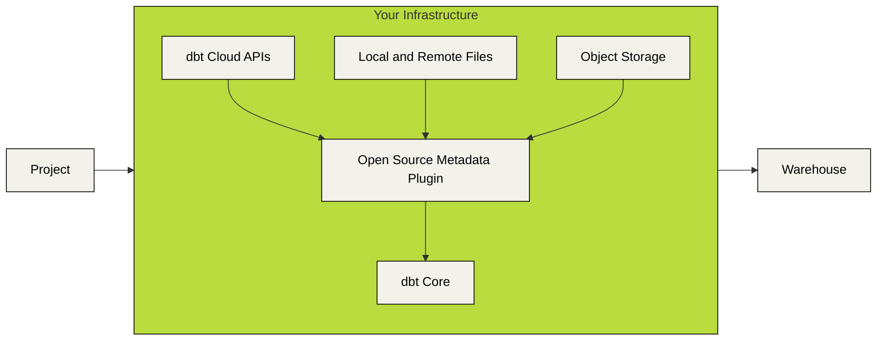

# dbt-loom

[](https://img.shields.io/pypi/v/dbt-loom)

dbt-loom is a dbt Core plugin that weaves together multi-project deployments. dbt-loom works by fetching public model definitions from your dbt artifacts, and injecting those models into your dbt project.



dbt-loom currently supports obtaining model definitions from:

- Local manifest files
- Remote manifest files via http(s)
- dbt Cloud
- GCS
- S3-compatible object storage services
- Azure Storage

## Getting Started

To begin, install the `dbt-loom` python package.

```console
pip install dbt-loom
```

Next, create a `dbt-loom` configuration file. This configuration file provides the paths for your
upstream project's manifest files.

```yaml
manifests:
  - name: project_name # This should match the project's real name
    type: file
    config:
      # A path to your manifest. This can be either a local path, or a remote
      # path accessible via http(s).
      path: path/to/manifest.json
```

By default, `dbt-loom` will look for `dbt_loom.config.yml` in your working directory. You can also set the
`DBT_LOOM_CONFIG` environment variable.

## How does it work?

As of dbt-core 1.6.0-b8, there now exists a `dbtPlugin` class which defines functions that can
be called by dbt-core's `PluginManger`. During different parts of the dbt-core lifecycle (such as graph linking and
manifest writing), the `PluginManger` will be called and all plugins registered with the appropriate hook will be executed.

dbt-loom implements a `get_nodes` hook, and uses a configuration file to parse manifests, identify public models, and
inject those public models when called by `dbt-core`.

## Advanced Features

### Loading artifacts from remote sources

`dbt-loom` supports automatically fetching manifest artifacts from a variety
of remote sources.

#### Using dbt Cloud as an artifact source

You can use dbt-loom to fetch model definitions from dbt Cloud by setting up a `dbt-cloud` manifest in your `dbt-loom` config, and setting the `DBT_CLOUD_API_TOKEN` environment variable in your execution environment.

```yaml
manifests:
  - name: project_name
    type: dbt_cloud
    config:
      account_id: <YOUR DBT CLOUD ACCOUNT ID>

      # Job ID pertains to the job that you'd like to fetch artifacts from.
      job_id: <REFERENCE JOB ID>

      api_endpoint: <DBT CLOUD ENDPOINT>
      # dbt Cloud has multiple regions with different URLs. Update this to
      # your appropriate dbt cloud endpoint.

      step_id: <JOB STEP>
      # If your job generates multiple artifacts, you can set the step from
      # which to fetch artifacts. Defaults to the last step.
```

#### Using an S3-compatible object store as an artifact source

You can use dbt-loom to fetch manifest files from S3-compatible object stores
by setting up ab `s3` manifest in your `dbt-loom` config. Please note that this
approach supports all standard boto3-compatible environment variables and authentication mechanisms. Please see the [boto3 documentation](https://boto3.amazonaws.com/v1/documentation/api/latest/guide/credentials.html#environment-variables) for more details.

```yaml
manifests:
  - name: project_name
    type: s3
    config:
      bucket_name: <YOUR S3 BUCKET NAME>
      # The name of the bucket where your manifest is stored.

      object_name: <YOUR OBJECT NAME>
      # The object name of your manifest file.
```

#### Using GCS as an artifact source

You can use dbt-loom to fetch manifest files from Google Cloud Storage by setting up a `gcs` manifest in your `dbt-loom` config.

```yaml
manifests:
  - name: project_name
    type: gcs
    config:
      project_id: <YOUR GCP PROJECT ID>
      # The alphanumeric ID of the GCP project that contains your target bucket.

      bucket_name: <YOUR GCS BUCKET NAME>
      # The name of the bucket where your manifest is stored.

      object_name: <YOUR OBJECT NAME>
      # The object name of your manifest file.

      credentials: <PATH TO YOUR SERVICE ACCOUNT JSON CREDENTIALS>
      # The OAuth2 Credentials to use. If not passed, falls back to the default inferred from the environment.
```

#### Using Azure Storage as an artifact source

You can use dbt-loom to fetch manifest files from Azure Storage
by setting up an `azure` manifest in your `dbt-loom` config. The `azure` type implements
the [DefaultAzureCredential](https://learn.microsoft.com/en-us/python/api/azure-identity/azure.identity.defaultazurecredential?view=azure-python)
class, supporting all environment variables and authentication mechanisms.
Alternatively, set the `AZURE_STORAGE_CONNECTION_STRING` environment variable to
authenticate via a connection string.

```yaml
manifests:
  - name: project_name
    type: azure
    config:
      account_name: <YOUR AZURE STORAGE ACCOUNT NAME> # The name of your Azure Storage account
      container_name: <YOUR AZURE STORAGE CONTAINER NAME> # The name of your Azure Storage container
      object_name: <YOUR OBJECT NAME> # The object name of your manifest file.
```

#### Using Snowflake Stage as an artifact source

You can use dbt-loom to fetch manifest files from Snowflake Stage by setting up a `snowflake` manifest in your `dbt-loom` config. Please note that this only
works for dbt-core versions 1.8.0 and newer.

```yaml
manifests:
  - name: project_name
    type: snowflake
    config:
      stage: stage_name # Stage name, can include Database/Schema
      stage_path: path/to/dbt/manifest.json # Path to manifest file in the stage
```

### Using environment variables

You can easily incorporate your own environment variables into the config file. This allows for dynamic configuration values that can change based on the environment. To specify an environment variable in the `dbt-loom` config file, use one of the following formats:

`${ENV_VAR}` or `$ENV_VAR`

#### Example:

```yaml
manifests:
  - name: revenue
    type: gcs
    config:
      project_id: ${GCP_PROJECT}
      bucket_name: ${GCP_BUCKET}
      object_name: ${MANIFEST_PATH}
```

### Gzipped files

`dbt-loom` natively supports decompressing gzipped manifest files. This is useful to reduce object storage size and to minimize loading times when reading manifests from object storage. Compressed file detection is triggered when the file path for the manifest is suffixed
with `.gz`.

```yaml
manifests:
  - name: revenue
    type: s3
    config:
      bucket_name: example_bucket_name
      object_name: manifest.json.gz
```

### Exclude nested packages

In some circumstances, like running `dbt-project-evaluator`, you may not want a
given package in an upstream project to be imported into a downstream project.
You can manually exclude downstream projects from injecting assets from packages
by adding the package name to the downstream project's `excluded_packages` list.

```yaml
manifests:
  - name: revenue
    type: file
    config:
      path: ../revenue/target/manifest.json
    excluded_packages:
      # Provide the string name of the package to exclude during injection.
      - dbt_project_evaluator
```

## Known Caveats

Cross-project dependencies are a relatively new development, and dbt-core plugins
are still in beta. As such there are a number of caveats to be aware of when using
this tool.

1. dbt plugins are only supported in dbt-core version 1.6.0-b8 and newer. This means you must be using a dbt adapter
   compatible with this version.
2. `PluginNodeArgs` are not fully-realized dbt `ManifestNode`s, so documentation generated by `dbt docs generate` may
   be sparse when viewing injected models.
