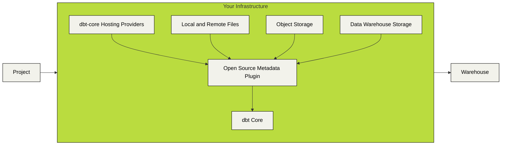

# dbt-loom

[](https://img.shields.io/pypi/v/dbt-loom)

dbt-loom is a dbt Core plugin that weaves together multi-project deployments. dbt-loom works by fetching public model definitions from your dbt artifacts, and injecting those models into your dbt project.



dbt-loom currently supports obtaining model definitions from:

- Local manifest files
- Remote manifest files via http(s)
- `dbt-core` Hosting Providers
  - dbt Cloud
  - Datacoves
  - Paradime
- Object Storage
  - GCS
  - S3-compatible object storage services
  - Azure Storage
- Database Warehouse Storage
  - Snowflake stages
  - Databricks Volume, DBFS, and Workspace locations

## Getting Started

To begin, install the `dbt-loom` python package.

```console
pip install dbt-loom
```

Next, create a `dbt-loom` configuration file. This configuration file provides the paths for your
upstream project's manifest files.

```yaml
manifests:
  - name: project_name # This should match the project's real name
    type: file
    config:
      # A path to your manifest. This can be either a local path, or a remote
      # path accessible via http(s).
      path: path/to/manifest.json
```

By default, `dbt-loom` will look for `dbt_loom.config.yml` in your working directory. You can also set the
`DBT_LOOM_CONFIG` environment variable.

## How does it work?

As of dbt-core 1.6.0-b8, there now exists a `dbtPlugin` class which defines functions that can
be called by dbt-core's `PluginManager`. During different parts of the dbt-core lifecycle (such as graph linking and
manifest writing), the `PluginManager` will be called and all plugins registered with the appropriate hook will be executed.

dbt-loom implements a `get_nodes` hook, and uses a configuration file to parse manifests, identify public models, and
inject those public models when called by `dbt-core`.

## Advanced Features

### Configuring artifact sources

#### Object storage

`dbt-loom` supports loading static manifest data stored within object storage
providers like S3, Azure Storage, and GCS. Note that these integrations use the
standard python libraries for each service (`boto3`, `gcs`, `azure`), and as
such their standard environment variables are supported.

```yml
manifests:
  # AWS-Hosted Manifest objects
  - name: aws_project
    type: s3
    config:
      # The name of the bucket where your manifest is stored.
      bucket_name: <YOUR S3 BUCKET NAME>

      # The object name of your manifest file.
      object_name: <YOUR OBJECT NAME>

  # Google Cloud Storage
  - name: gcs_project
    type: gcs
    config:
      # The alphanumeric ID of the GCP project that contains your target bucket.
      project_id: <YOUR GCP PROJECT ID>

      # The name of the bucket where your manifest is stored.
      bucket_name: <YOUR GCS BUCKET NAME>

      # The object name of your manifest file.
      object_name: <YOUR OBJECT NAME>

      # The OAuth2 Credentials to use. If not passed, falls back to the default inferred from the environment.
      credentials: <PATH TO YOUR SERVICE ACCOUNT JSON CREDENTIALS>

  # Azure Storage
  - name: azure_project
    type: azure
    config:
      # The name of your Azure Storage account
      account_name: <YOUR AZURE STORAGE ACCOUNT NAME>

      # The name of your Azure Storage container
      container_name: <YOUR AZURE STORAGE CONTAINER NAME>

      # The object name of your manifest file.
      object_name: <YOUR OBJECT NAME>

      # Alternatively, Set the `AZURE_STORAGE_CONNECTION_STRING` environment
      # variable to authenticate via a connection string.
```

#### `dbt-core` hosting providers

`dbt-loom` supports calling the APIs for different `dbt-core` hosting providers
to obtain manifest data, including dbt Cloud and Paradime. Each client requires
specific configuration values to operate correctly.

```yaml
manifests:
  - name: dbt_cloud_project
    type: dbt_cloud
    config:
      account_id: <YOUR DBT CLOUD ACCOUNT ID>

      # Job ID pertains to the job that you'd like to fetch artifacts from.
      job_id: <REFERENCE JOB ID>

      # dbt Cloud has multiple regions with different URLs. Update this to
      # your appropriate dbt cloud endpoint.
      api_endpoint: <DBT CLOUD ENDPOINT>

      # If your job generates multiple artifacts, you can set the step from
      # which to fetch artifacts. Defaults to the last step.
      step_id: <JOB STEP>

  - name: paradime_project
    type: paradime
    config:
      # It is recommended to use environment variables to set your API credentials.
      api_key: <YOUR PARADIME API KEY>
      api_secret: <YOUR PARADIME API SECRET>
      api_endpoint: <PARADIME API ENDPOINT>

      # The name of the Paradime Bolt schedule to fetch artifacts from.
      schedule_name: <YOUR PARADIME SCHEDULE NAME>

      # (Optional) The index of the command to fetch the artifact from. If not provided,
      # it will search through all commands in the schedule run starting from the last command.
      command_index: <YOUR PARADIME SCHEDULE COMMAND INDEX>
```

#### Data Warehouses

Lastly, uou can use dbt-loom to fetch manifest files from Snowflake Stage and
from Databricks Volumes, DBFS, and Workspace locations by setting up a `snowflake` or `databricks` manifest in your `dbt-loom` config.

> [!WARNING]
> The `dbt-databricks` adapter or Python SDK is required to use the `databricks` manifest type

> [!WARNING]
> Please note that these only work for dbt-core versions 1.8.0 and newer.

```yaml
manifests:

manifests:
  - name: databricks_project
    type: databricks
    config:
      path: <WORKSPACE, VOLUME, OR DBFS PATH TO MANIFEST FILE>

      # The `databricks` type implements Client Unified Authentication (https://docs.databricks.com/aws/en/dev-tools/auth/unified-auth), supporting all environment variables and authentication mechanisms.

  - name: snowflake_project
    type: snowflake
    config:
      stage: stage_name # Stage name, can include Database/Schema
      stage_path: path/to/dbt/manifest.json # Path to manifest file in the stage
```

### Using environment variables

You can easily incorporate your own environment variables into the config file. This allows for dynamic configuration values that can change based on the environment. To specify an environment variable in the `dbt-loom` config file, use one of the following formats:

`${ENV_VAR}` or `$ENV_VAR`

#### Example:

```yaml
manifests:
  - name: revenue
    type: gcs
    config:
      project_id: ${GCP_PROJECT}
      bucket_name: ${GCP_BUCKET}
      object_name: ${MANIFEST_PATH}
```

### Gzipped files

`dbt-loom` natively supports decompressing gzipped manifest files. This is useful to reduce object storage size and to minimize loading times when reading manifests from object storage. Compressed file detection is triggered when the file path for the manifest is suffixed
with `.gz`.

```yaml
manifests:
  - name: revenue
    type: s3
    config:
      bucket_name: example_bucket_name
      object_name: manifest.json.gz
```

### Exclude nested packages

In some circumstances, like running `dbt-project-evaluator`, you may not want a
given package in an upstream project to be imported into a downstream project.
You can manually exclude downstream projects from injecting assets from packages
by adding the package name to the downstream project's `excluded_packages` list.

```yaml
manifests:
  - name: revenue
    type: file
    config:
      path: ../revenue/target/manifest.json
    excluded_packages:
      # Provide the string name of the package to exclude during injection.
      - dbt_project_evaluator
```

### Optional manifests

If you want to allow a manifest reference to be missing (e.g. using dbt-loom for an upstream project to see dependencies), you can set `optional: true` for that manifest entry. When `optional` is true and the manifest file does not exist, dbt-loom will skip loading it without raising an error. If `optional` is false or omitted (the default), missing manifests will cause an error.

```yaml
manifests:
  - name: revenue
    type: file
    config:
      path: ../revenue/target/manifest.json
    optional: true # If the manifest file is missing, do not raise an error
```

## Known Caveats

Cross-project dependencies are a relatively new development, and dbt-core plugins
are still in beta. As such there are a number of caveats to be aware of when using
this tool.

1. dbt plugins are only supported in dbt-core version 1.6.0-b8 and newer. This
   means you must be using a dbt adapter compatible with this version.
2. `PluginNodeArgs` are not fully-realized dbt `ManifestNode`s, so
   documentation generated by `dbt docs generate` may
   be sparse when viewing injected models.
