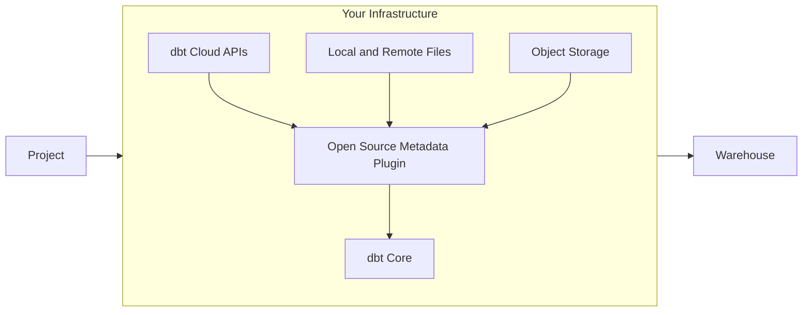

# dbt-loom

`dbt-loom` is a dbt Core plugin that weaves together multi-project deployments. It works by fetching public model definitions from your dbt artifacts, and injecting those models into your dbt project.

dbt-loom currently supports obtaining model definitions from:

- Local manifest files
- Remote manifest files via http(s)
- dbt Cloud
- GCS
- S3-compatible object storage services
- Azure Storage

## How does it work?

As of dbt-core 1.6.0-b8, there now exists a `dbtPlugin` class which defines functions that can
be called by dbt-core's `PluginManger`. During different parts of the dbt-core lifecycle (such as graph linking and
manifest writing), the `PluginManger` will be called and all plugins registered with the appropriate hook will be executed.

dbt-loom implements a `get_nodes` hook, and uses a configuration file to parse manifests, identify public models, and
inject those public models when called by `dbt-core`.

## Known Caveats

Cross-project dependencies are a relatively new development, and dbt-core plugins
are still in beta. As such there are a number of caveats to be aware of when using
this tool.

1. dbt plugins are only supported in dbt-core version 1.6.0-b8 and newer. This means you must be using a dbt adapter
   compatible with this version.
2. `PluginNodeArgs` are not fully-realized dbt `ManifestNode`s, so documentation generated by `dbt docs generate` may
   be sparse when viewing injected models.
